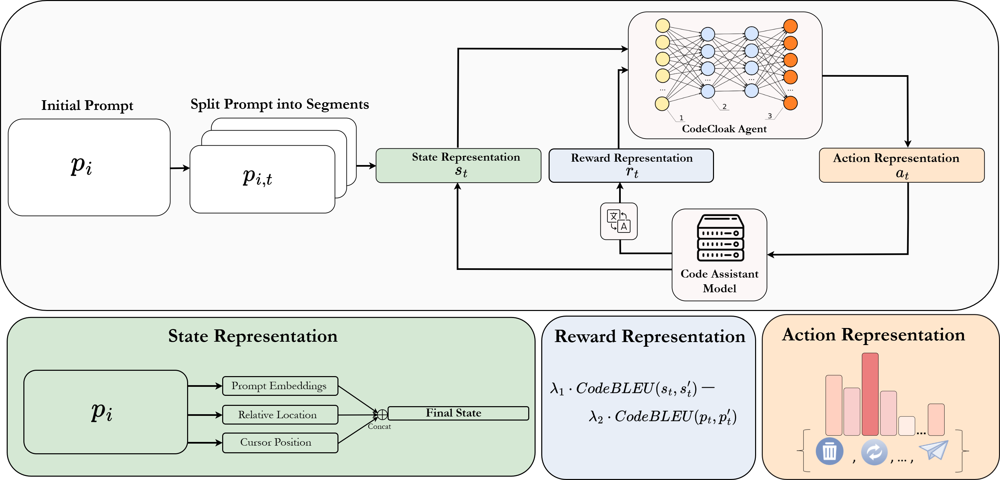

# CodeCloak: A Method for Mitigating Code Leakage by LLM Code Assistants

This repository contains the implementation of **CodeCloak**, a novel deep reinforcement learning (DRL) agent that manipulates code prompts to mitigate code leakage when using LLM-based code assistants, while preserving the relevance and usefulness of generated suggestions.

## Research Overview

This work addresses the critical privacy risk of code leakage via prompts transmitted to third-party code assistant services during development. We present CodeCloak, a DRL agent that learns to strategically manipulate prompts before sending them to code assistants, achieving two contradictory objectives:

1. **Minimizing code leakage** - Protecting proprietary and sensitive code information
2. **Preserving suggestion relevance** - Maintaining useful and accurate code suggestions




## Repository Structure

```
CodeCloak/
├── assets/  
│   └── TrainCodeCloak.png
├── CodeManipulations.py    # Code for prompt manipulations
├── DataSet.py              # Dataset handling and preprocessing utilities  
├── EvalEnv.py              # Evaluation environment for trained agent assessment
├── LLMmodel.py             # Large Language Model interface and utilities
├── Normalizations.py       # Observation and reward normalization wrappers
├── SendRequestLLM.py       # LLM request handling and response generation
├── StarEncoder.py          # StarEncoder model integration for embeddings
├── TrainEnv.py             # Training environment with Recurrent PPO
├── utils.py                # General utility functions and helpers
└── requirements.txt        # Python dependencies
```

## Installation
### Before running the project:
**Install dependencies:**
```bash
pip install -r requirements.txt
```
**Required models:**

Download both StarCoder and StarEncoder models.

## Usage

### Training CodeCloak Agent

```python
from TrainEnv import train_model

# Start training with default hyperparameters
# Agent learns to balance code leakage mitigation and suggestion preservation
train_model()
```


